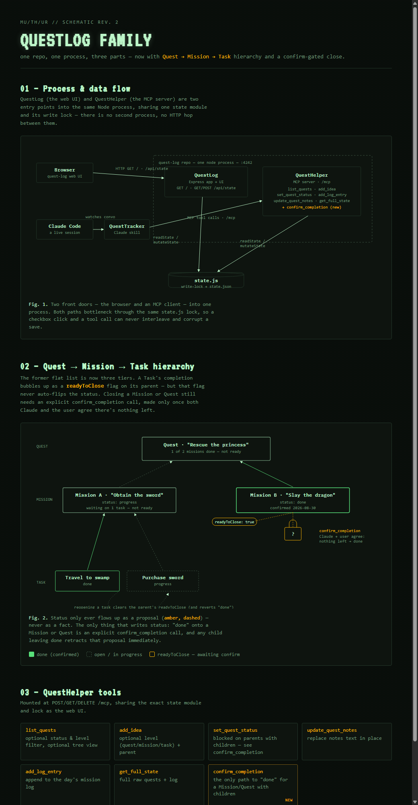

# QuestLog

Self-hosted project/idea tracker — checkboxes, status pills (idea / active / blocked / done),
and a running mission log. Built as a themed personal tool, not a generic app.

This repo is the QuestLog family:
- **`/app`** — the QuestLog web app (Express server, HTML/JS UI)
- **`/questhelper`** — QuestHelper, the MCP server mounted on the same Express app
- **`/state.js`** — shared state module (read/write lock) both of the above talk to
- **`questtracker-skill.md`** — QuestTracker, the Claude Code skill that keeps this quest log in sync with conversations



State lives in `data/state.json` on disk (volume-mounted in Docker so it survives rebuilds).
**This file is gitignored and never committed** — the actual project/idea content stays local
to wherever this is deployed and never lands in this (public) repo; only the app code does.
The client fetches nothing on load — the server embeds the current state directly into the
page — and every checkbox toggle, status cycle, or new idea posts the full updated state back
to `POST /api/state`. No database, no auth — this is meant to run on a trusted local network.

Writes are serialized through an in-process lock (`state.js`) so concurrent writers (multiple
browser tabs, MCP tool calls) can't interleave and corrupt a save. Each save also carries a
`_version` counter: if the state on disk has moved on since the client last loaded it,
`POST /api/state` returns `409` instead of silently overwriting the newer data. `POST /api/state`
also rejects a payload containing a quest with an invalid/missing `status` or a duplicate `id`
(`400`), since a bad quest object used to crash the page for every visitor.

## MCP (QuestHelper)

QuestHelper — the MCP server, living in `/questhelper` (formerly the separate `quest-log-mcp`
repo, merged in 2026-08-30, since renamed) — is mounted on the same Express app at
`POST/GET/DELETE /mcp`, sharing the exact same state module and lock as the web UI — no separate
process or HTTP round-trip between the two. Tools: `list_quests`, `add_idea`, `set_quest_status`,
`update_quest_notes`, `add_log_entry`, `get_full_state`. Point an MCP client at
`http://<host>:4242/mcp` (or `https://` once a cert is configured, see below).

Note: MCP sessions are still held in memory (`questhelper/questhelper.js`), so a restart of this
server still drops any already-connected client's session — merging removed one of the two
processes that used to cause that, but didn't eliminate it. Tracked as
[quest-log-mcp#2](https://github.com/hooptiej/quest-log-mcp/issues/2) (repo now archived; issue
still tracked there for history).

### Connecting over HTTPS (trusting the self-signed cert)

Since the server's HTTPS cert is self-signed (see below), an MCP client talking to `https://` will
reject the connection outright (`DEPTH_ZERO_SELF_SIGNED_CERT`) rather than showing a clickable
warning like a browser does. On each new machine/client, trust it once:

```bash
# pull the server's current cert
openssl s_client -connect <host>:4242 -servername <CERT_SAN_DNS> </dev/null 2>/dev/null \
  | openssl x509 -outform PEM > quest-log.pem

# point Node at it (works for any Node-based MCP client, including Claude Code)
# Windows (persists across sessions):
#   [System.Environment]::SetEnvironmentVariable('NODE_EXTRA_CA_CERTS', 'C:\path\to\quest-log.pem', 'User')
# macOS/Linux (add to shell profile):
#   export NODE_EXTRA_CA_CERTS=/path/to/quest-log.pem
```

Takes effect on the next new process — a client that's already running needs a restart to pick it
up. If the container's cert ever gets regenerated (new volume, cert files deleted), re-run the
`openssl s_client` step to grab the new one.

## Running locally

```bash
cp data/state.example.json data/state.json  # first time only
npm install
npm start
```

The server refuses to start if `data/state.json` doesn't exist, rather than silently creating
an empty one — `data/state.example.json` (committed, generic, no real content) is the starting
shape to copy from.

## Running with Docker

```bash
docker compose up -d --build
```

`docker-compose.yml` mounts `./data` into the container so state persists across rebuilds.
By default the container joins an external `ipvlan` network (`questlog-lan`) and gets its own
static LAN IP (see the `networks:` block), rather than being port-mapped on the host — so it's
reachable directly at `http://<its-ip>/mcp`, no port number needed. Set `PORT` (default `80`
in this mode, `4242` if you fall back to host port-mapping) and `DISABLE_TLS=1` to skip the
cert dance entirely for a LAN-only deployment (see HTTPS section below).

```bash
docker network create -d ipvlan --subnet=<lan-subnet> --gateway=<lan-gateway> \
  -o parent=<host-nic> -o ipvlan_mode=l2 questlog-lan
```

## HTTPS

Set `DISABLE_TLS=1` to skip certs entirely and serve plain HTTP — reasonable for a LAN-only
deployment with its own dedicated IP, since there's no shared host/port to spoof. Otherwise,
`docker-entrypoint.sh` generates a self-signed cert into `./certs` (also volume-mounted) on
first boot if one isn't already there, then starts the server — no manual setup needed for a
fresh deployment. `server.js` serves over HTTPS automatically whenever `certs/cert.pem` and
`certs/key.pem` exist (and `DISABLE_TLS` isn't set), falling back to plain HTTP otherwise (e.g.
for local dev without a cert). Configure what the cert covers via `CERT_SAN_DNS` (default
`questlog.local`) and `CERT_SAN_IP` (unset by default) env vars — set `CERT_SAN_IP` to whatever
address this is actually reachable at. Since it's self-signed, browsers still show a one-time
"not trusted" warning to click through; a self-signed cert avoids a hard connection failure on
`https://`, not that warning.

`./certs` is gitignored — the private key never leaves the machine it's generated on.

## mDNS

If you want a `.local` hostname instead of a raw IP (matching `CERT_SAN_DNS` above so the
cert's name actually matches what's in the address bar), that's a host-level concern outside
this app — e.g. a systemd unit running `avahi-publish -a -R questlog.local <ip>` on the
Linux host serving this. Not something Docker or this repo can do on their own since it needs
to talk to the host's own mDNS responder.

## Editing the design

`app/template.html` holds the styles and the static page shell (head, panels, form).
`app/public/app.js` holds all client-side rendering and interaction logic. `app/server.js` just
serves the template with the current state spliced in and handles the `/api/state` save endpoint.

## Themes

The DISPLAY MODE dropdown in the boot panel switches the whole UI between visual themes,
persisted client-side via `localStorage` (no server round-trip). Themes are CSS variable sets
keyed off `data-theme` on `<html>` — the default (`muthur`, no attribute needed) is the
original dark green/purple terminal look; `terminal` ("Field Terminal") is a cleaner
phosphor-green/amber CRT look (VT323 + IBM Plex Mono). Adding another theme means adding one
more `[data-theme="..."]` block in `app/template.html` that redefines the `--bg`/`--surface`/
`--accent`/`--font-*` variables — the rest of the page's CSS reads only those variables, so a
new theme rarely needs component-level overrides. See [#9](https://github.com/hooptiej/quest-log/issues/9)
for the WoW and Fallout presets still on the backlog.

## QuestTracker

`questtracker-skill.md` is the Claude Code skill (installed locally as `~/.claude/skills/quest-tracker/SKILL.md`)
that watches conversations for new ideas, work starting, or things shipping/blocking, and keeps
them in sync with this quest log via QuestHelper's MCP tools. Versioned here so the skill travels
with the app and MCP code it depends on.
